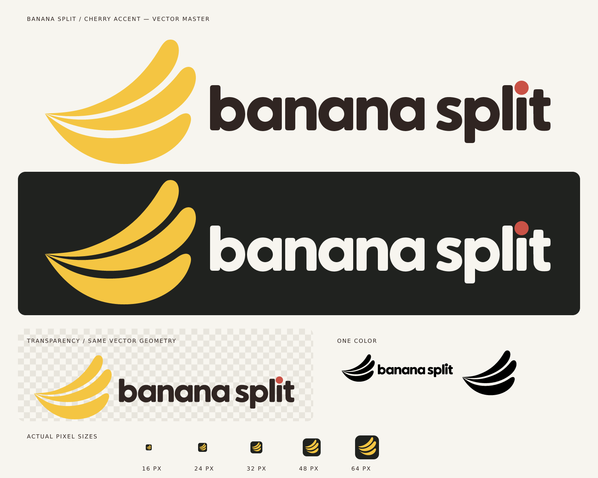

# Banana Split — Cherry Accent

The selected identity, rebuilt as editable vector artwork. Three banana curves accompany a rounded lowercase wordmark with a cherry-red dot over the i. Lettering is outlined: no font installation, embedded bitmap, or external resource is needed.



## Ready-to-use files

| Use | SVG master | PNG export |
| --- | --- | --- |
| Logo on light backgrounds | [logo-light.svg](logo-light.svg) | [2880 × 768 PNG](logo-light.png) |
| Logo on dark backgrounds | [logo-dark.svg](logo-dark.svg) | [2880 × 768 PNG](logo-dark.png) |
| One-color black | [logo-black.svg](logo-black.svg) | [2880 × 768 PNG](logo-black.png) |
| One-color white | [logo-white.svg](logo-white.svg) | [2880 × 768 PNG](logo-white.png) |
| Standalone symbol | [icon.svg](icon.svg) | [1024 × 1024 PNG](icon.png) |
| Symbol on a charcoal tile | [app-icon.svg](app-icon.svg) | [1024 × 1024 PNG](app-icon.png) |
| Small favicon | [favicon.svg](favicon.svg) | [16 px](icons/favicon-16.png), [32 px](icons/favicon-32.png), [48 px](icons/favicon-48.png) |

The four full logos and standalone symbol have genuinely transparent backgrounds, including letter counters and spaces between the banana sections. The app icon and favicon intentionally include a charcoal tile with transparent corners. [favicon.ico](favicon.ico) bundles 16, 32, and 48 px versions.

Additional transparent symbols are in [icons](icons), with a separate [small-size master](icon-small.svg) for 16–32 px use. [Black](icon-black.svg) and [white](icon-white.svg) symbol masters are also included.

Open [preview.html](preview.html) to switch backgrounds and adjust the logo's display size. The [proof sheet](proof.png) is a standalone image for review and sharing.

## Design details

- Smooth filled Bézier paths replace the generated raster contours and paper texture.
- The three a glyphs and two n glyphs reuse identical geometry with consistent spacing; b and p share the same bowl construction.
- A geometric circle supplies the cherry accent. Its color and placement stay consistent in the light and dark versions.
- Full-size symbol variants share a single master. The small-size variant widens the gaps and simplifies the common tip so the sections remain legible.
- All logo fills are solid; antialiasing occurs only at shape edges.

## Colors

| Color | Exact SVG value |
| --- | --- |
| Banana yellow | `#F4C542` |
| Cocoa | `#302522` |
| Cherry red | `#C95246` |
| Ivory | `#F7F5EF` |
| Charcoal tile | `#20221F` |

## Usage

Keep the supplied proportions and clear space. Use the cocoa-lettered version on light backgrounds and ivory-lettered version on dark backgrounds. Below approximately 240 px wide, prefer the symbol or favicon over the full wordmark. For tiny icons on light surfaces, use the charcoal-tile favicon for contrast. The cherry is the i-dot in the wordmark; it is not added to the standalone symbol.

## Editable source and reproducible exports

[source/geometry.json](source/geometry.json) holds the symbol curves, custom glyph outlines, positioning, and palette. [build.cjs](build.cjs) produces every SVG, PNG, ICO, and the proof sheet from that source, and copies the square icon assets into the plugin and bundled skill.

The renderer tools are separate from the Banana Split application dependencies:

```sh
npm install --prefix /tmp/banana-logo-tools --no-audit --no-fund --ignore-scripts @resvg/resvg-js@2.6.2 pngjs@7.0.0
node assets/branding/cherry-accent/build.cjs --tools /tmp/banana-logo-tools
```

The command may use any writable tools directory in place of `/tmp/banana-logo-tools`. The exported SVGs and PNGs need none of these dependencies.

## Verification and provenance

[verification.json](verification.json) records the export dimensions and alpha checks. The rebuild verifies transparent corners and letter counters, open symbol gaps, exact opaque palette colors, matching alpha geometry across light/dark versions, and no external fonts or embedded images in the logo SVGs. The proof sheet and interactive preview cover light, dark, checkerboard, monochrome, and small-size use.

The [approved concept](source/concept.png) supplied the design direction. The final artwork uses constructed curves, normalized custom glyphs, and smoothed reference outlines; it is not a new image-generation pass. Earlier image-generation prompts remain in [PROMPTS.md](PROMPTS.md) as concept history only.
