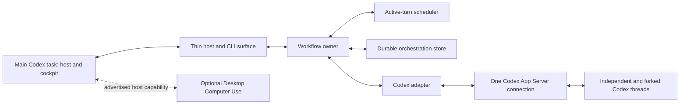
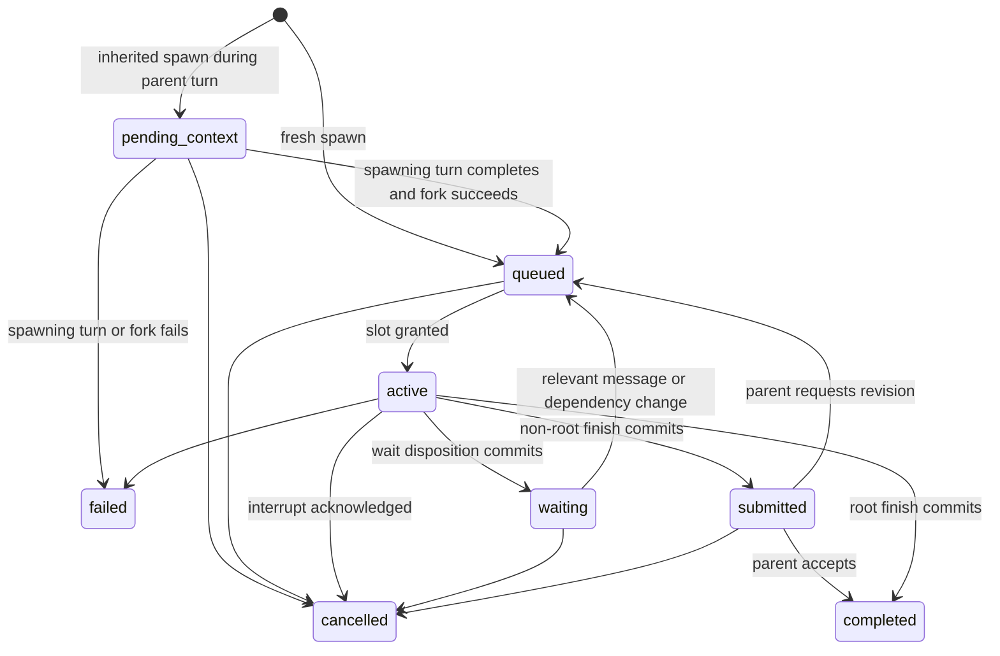

# Banana Split V1

## Standalone production build specification

Status: normative V1 build specification

Delivery contract: one feature-complete, production-quality implementation

Hardening posture: deliberately narrow supported operating envelope

## 1. Purpose of this document

Banana Split V1 is a from-scratch implementation delivered as one complete task. This document is the sole normative product and build contract. An implementation agent must not need an earlier Banana Split version, a review transcript, another repository, or undocumented product guidance to complete it.

The document emphasizes why Banana Split exists, what behavior the finished product must provide, what the runtime must guarantee, and what it must leave to intelligent agents. Architecture and mechanics appear where they preserve product intent or record a proven solution to a real orchestration problem. They are constraints on outcomes, not instructions to reproduce an earlier codebase.

V1 has no MVP subset or acceptable partial-delivery milestone. It is complete only when every V1 feature in this document works together as an installed, documented, tested system. The implementation order in section 30 is internal sequencing, not permission to stop after a phase.

"Production-quality" and "lean" are both required:

- Production-quality means the supported workflows are integrated, durable across an ordinary runtime restart, permission-safe, observable, packaged, documented, and verified end to end.
- Lean means the implementation uses the smallest clear state model and the fewest abstractions and branches that satisfy this specification.
- Feature completeness does not imply broad hardening. V1 supports the stated flows and critical safety boundaries, not every hypothetical input, race, platform variation, or recovery strategy.

The intended V1 operating envelope is one trusted local Windows user, one main Codex host task, one local Banana runtime, one workspace per workflow, multiple workflows in that runtime, and one explicitly supported Codex App Server capability set. Hostile multi-tenancy, distributed runtime coordination, high availability, rolling upgrades, legacy compatibility, automated schema migration across released versions, and exhaustive malformed-input recovery are outside V1.

Within that envelope, failures must be honest and leave inspectable state. Outside it, a concise actionable error or safe stop is preferred to automatic repair, fallback, retry, or speculative edge-case machinery. Broad hardening begins only after explicit owner direction informed by real use.

### 1.1 Supported product shape

V1 supports Windows 11 x64. The installed product contains:

- A Codex plugin and host skill used from the main Codex task
- A bundled local Banana runtime and Codex App Server adapter
- The agent and host tool surfaces defined in sections 20 and 21
- One private durable-data directory and one startup configuration file
- Read-only `watch`, `inspect`, and `transcript` CLI commands
- Installation, configuration, operation, recovery, and troubleshooting documentation

The host skill starts or reconnects to the one local runtime and drives the poll/respond loop from the main Codex task. The runtime may own multiple workflows, but V1 does not support two Banana runtime instances operating concurrently for the same user. `max_active_turns`, runnable ordering, Computer Use serialization, approval routing, and workflow discovery are runtime-wide.

The durable store is an implementation-private protocol with exactly one writer: the runtime. The host surface and CLI call or read through that owner; they never rewrite workflow files. Direct user editing, file-watcher coordination, workflow movement between runtimes, and multiple-writer recovery are outside V1. Internal process layout and storage technology remain implementation choices.

## 2. Product thesis

Banana Split is a minimal recursive agent runtime for Codex.

It lets an agent create another independent agent, choose whether that child inherits context or starts fresh, choose an execution preset, exchange messages and advice, request an advertised host capability, wait without consuming active capacity, review direct-child results, and continue building a workflow as deep or as broad as the work requires.

The runtime does not design the organization. Agents do.

An agent may be a small worker, a researcher, an implementer, a reviewer, an architect, an advisor, or the owner of an entire phase that creates a substantial subtree. Those meanings come from the task given to the agent, not from a runtime role taxonomy.

The runtime exists to make model-designed workflows mechanically dependable:

- Independent threads really are independent.
- Inherited context really is inherited rather than approximated.
- Active-turn capacity is bounded without bounding the total useful workflow.
- Waiting agents release capacity and resume when their dependency changes.
- Advice requests and review decisions cannot be lost or confused with unrelated messages.
- A child can request a host-only capability without pretending it owns that capability.
- Model routing is explicit and observable.
- Permissions never exceed the trusted host ceiling.
- Workflow identity and useful partial results survive a runtime interruption.

## 3. Design principles

### 3.1 Mechanism over management

Banana Split provides mechanisms that agents cannot reliably invent through prose: thread creation, scheduling, queueing, context provenance, message delivery, dependency tracking, permission enforcement, interruption, and recovery.

It does not encode organizational advice as runtime law. Decomposition, phase design, role names, review criteria, and task-specific stop conditions belong to agent judgment and prompts.

### 3.2 Recursive intelligence, not a worker swarm

Children are ordinary capable agents. Any child may own a complex phase and create its own descendants. The tree is the evolving shape of the reasoning process, not a fixed lead-and-workers organization chart.

Deep trees and many sequential phases are expected behavior. The runtime must not impose a small default depth or lifetime-agent limit.

### 3.3 Concurrency is capacity, not population

`max_active_turns` limits simultaneous model turns. It does not limit how many agents may exist or how many may participate over the life of a workflow.

Pending-context, queued, waiting, submitted, completed, failed, and cancelled agents consume no active-turn slot. A workflow may therefore use hundreds of agents over time while the runtime runs no more than the configured number of model turns at once.

The V1 default is 16 active turns. The product should call this exactly what it is; phrases such as "16-agent limit" are misleading.

### 3.4 Context is an explicit provenance choice

Every child is created with one of two context sources:

- `fresh`: start a new Codex thread without the parent's conversation history.
- `inherit`: fork the parent's Codex thread through a stable completed turn.

An optional parent-authored brief may accompany either source. A brief is task content, not a third context mode, and it must never be described as inherited history.

### 3.5 Prompts describe behavior; presets describe execution

Behavioral roles do not belong in configuration. If a parent needs a child to act as a reviewer or phase owner, it says so in the task.

Named presets contain model execution settings only:

- Model
- Reasoning effort
- Service tier

Permission restrictions are orthogonal and explicit. They are not hidden inside a model preset.

### 3.6 Advice is a dependency, not an ordinary message

An agent asking for guidance is declaring that its next useful action depends on a particular answer. The runtime should atomically correlate the request, notify the advisor, release the asker's slot at the turn boundary, and resume the asker only when the request is resolved or fails.

No advisor role is required. An agent becomes an advisor because another agent asks it a question.

### 3.7 Every parent owns acceptance of its direct children

A child's result is a proposal, not automatically accepted truth. A non-root child submits its result to its direct parent. The parent accepts it or requests revision in the same child thread.

This is the core review mechanism. It distributes review throughout a deep tree without introducing a centralized reviewer role or general review engine.

Independent review remains an agent-designed pattern: a parent may create a fresh child to inspect an artifact, then use that evidence when accepting or revising another child's submission.

### 3.8 Mechanical truth and model judgment are separate

The runtime reports facts such as running, waiting, submitted, failed, or completed. Agents report judgments such as success, partial, blocked, or unsuccessful.

A mechanically completed workflow is not proof that the user's goal was achieved. A model's claim of success is not proof that the workflow is mechanically settled.

### 3.9 Codex owns conversations

Codex App Server is authoritative for thread history and model-turn state. Banana Split stores only orchestration metadata. It must not persist duplicate transcripts, synthesize hidden context, or treat a generated summary as equivalent to a thread fork.

### 3.10 Small is a product requirement

Every runtime concept must justify its existence through a correctness, safety, or lifecycle requirement that prompts alone cannot satisfy.

The preferred response to an uncertain feature is omission. Configuration watchers, workflow DSLs, role graphs, automatic routing intelligence, consensus engines, and similar abstractions stay out until real use demonstrates that the smaller primitives are inadequate.

Implementation code should be direct and unsurprising. Do not add generalized frameworks, compatibility layers, recovery trees, or validation branches for cases not required by the supported operating envelope, a core invariant, or an acceptance scenario. A clear surfaced failure is usually more valuable in V1 than an unproven attempt to recover.

### 3.11 Visibility stays close to the user

Every managed agent must be fully inspectable, but full visibility does not require one top-level Desktop task per agent. The main Codex task is the workflow cockpit: ordinary polling shows enough nearby state to understand the tree and notice anything requiring attention, while deeper activity and complete transcripts are available on demand.

Desktop and CLI views are thin, read-only projections over the same durable orchestration state and Codex-owned transcripts. A localhost dashboard or external window is not required for normal operation. V1 uses the conversation-native and CLI views defined here; a separate graphical dashboard is outside its scope.

### 3.12 Desktop-only capabilities belong to the host

The runtime does not grant Computer Use to managed CLI/App Server agents. Instead, any agent may directly request an advertised capability from the main host task. The request is durable and correlated; the host performs or declines the action under its own permissions and returns evidence to the requester.

This is capability delegation, not authority delegation. The agent describes the bounded job, the runtime transports and tracks it, and the Desktop host remains responsible for approvals and execution.

## 4. Responsibility boundary

### 4.1 The runtime owns

- Stable workflow and agent identities
- Parent-child relationships
- Independent Codex thread creation
- Fresh versus inherited context provenance
- Execution-preset resolution
- Trusted permission ceilings and narrower child restrictions
- Active-turn scheduling and durable runnable ordering
- Agent mailboxes and ordered delivery
- Wait dependencies
- Correlated advice requests and responses
- Correlated host-capability requests and responses
- Child submission and direct-parent review state
- Turn interruption and subtree/workflow cancellation
- Material events and host-visible state
- Read-only workflow, agent, and transcript inspection
- Minimal durable orchestration state and recovery
- Codex App Server protocol adaptation

### 4.2 Agents own

- Decomposition and topology
- Behavioral roles and task wording
- Whether a child should be small, substantial, or itself an orchestrator
- What information belongs in an optional brief
- Which preset is appropriate for a task
- Which agent should provide advice
- Whether and why an advertised host capability is needed
- The bounded task, constraints, and useful evidence requested from the host
- Review criteria and the substance of review
- Whether independent fresh-context review is warranted
- Whether failed work should be retried through a new explicit action
- Synthesis and task-level acceptance

### 4.3 The host or user owns

- The original objective and workspace
- The trusted permission ceiling
- Runtime-wide active-turn capacity at process startup
- Available execution presets and recommendation policy
- Which host capabilities are advertised to a workflow
- Execution, decline, and evidence for Computer Use requests
- Final authority over approvals and consequential actions
- Workflow cancellation or emergency spawn freeze
- Acceptance of the root agent's result

## 5. Conceptual architecture

The smallest coherent design has four runtime components:

1. **Workflow owner**
   Holds the agent tree, lifecycle states, mailboxes, wait dependencies, advice and host-capability requests, submissions, review decisions, results, approvals, and material-event cursor.

2. **Turn scheduler**
   Grants a bounded number of active-turn leases and selects from a durable FIFO backlog of runnable agents. It schedules turns, not agents.

3. **Codex adapter**
   Isolates all App Server coupling: thread start/fork/resume, turn start/interrupt, dynamic tool registration, approval handling, model capability discovery, and event normalization.

4. **Durable orchestration store**
   Records the minimum state needed to discover and recover workflows without duplicating Codex transcripts.

The host-facing MCP and CLI surfaces are thin projections over these components, not separate orchestration engines. Computer Use remains a capability of the main Desktop host task; Banana only carries a request to that host and its correlated response back.



The implementation language, storage technology, and internal process topology are intentionally unspecified. Choose the smallest reliable packaged runtime that fits Windows 11 x64. One process per agent is not a product requirement.

## 6. Core concepts

### Workflow

A durable recursive tree beginning with one root Banana agent. A workflow owns its resolved preset snapshot, identities, relationships, events, and results. Runtime scheduler capacity is shared rather than workflow-owned.

### Agent

A Codex thread plus minimal orchestration metadata: stable ID, thread ID, parent, children, task, context provenance, resolved preset, effective permissions, lifecycle state, mailbox, dependencies, submission, and result.

### Model turn

One in-flight dispatched Codex generation, including time paused for a Codex approval. Only an in-flight turn consumes an active-turn slot.

### Preset

A named immutable model configuration resolved from the workflow's configuration snapshot. Presets contain no behavioral instructions.

### Brief

Optional parent-authored task context supplied in addition to the child's task. It may emphasize decisions, constraints, evidence, artifacts, or open questions. The runtime treats it as payload and does not generate it.

### Advice request

A correlated dependency with one requester, one advisor, and one terminal resolution: answered, advisor unavailable, cancelled, or failed.

### Host capability request

A correlated dependency from any managed agent to the main host for an advertised capability that is unavailable inside the managed agent thread. V1 supports only `computer_use`. Its terminal resolution is completed with evidence, declined, unavailable, cancelled, or failed.

### Submission

The latest structured result proposed by a non-root child and awaiting its direct parent's `accept` or `revise` decision.

### Result

A structured model judgment containing at least an outcome and summary, with optional task-specific evidence.

## 7. Agent tree and lifecycle

Every non-root agent has exactly one parent. V1 has no detached agents.

An agent moves through a deliberately small state set:

- `pending_context`: an inherited child exists, but its spawning parent turn has not yet completed and therefore cannot be forked safely.
- `queued`: runnable but waiting for an active-turn slot.
- `active`: owns a slot and has a Codex turn in progress.
- `waiting`: has no turn in progress and awaits a message or declared dependency.
- `submitted`: has proposed a result and awaits direct-parent review.
- `completed`: its direct parent accepted its submission, or it is the root and finished.
- `failed`: a model turn or required runtime action failed.
- `cancelled`: its work was explicitly stopped.

Starting and recovery may use transient internal markers. V1 uses one important internal marker, `turn_closing`, without adding it to the public agent-state enum.



A non-root agent may not submit while it has unfinished or unreviewed descendants. A root may not finish until all descendants are completed, failed, or cancelled and no review obligation remains.

### 7.1 Turn-closing rule

`banana_wait`, `banana_ask`, `banana_request_host`, and `banana_finish` are turn-closing tools. A successful call persists exactly one pending disposition and marks the active turn `turn_closing`; the agent remains publicly `active` and keeps its lease until Codex reports that the turn completed.

While `turn_closing`:

- Further state-mutating Banana calls from that turn fail with `turn_closing`.
- The agent is not an eligible new ordinary-message or advice target.
- Already-owned events may be buffered, and explicit cancellation may override the disposition.
- The closing effect is not delivered externally until successful turn completion. If the containing turn fails or is interrupted, the disposition does not execute: an armed request becomes terminal `cancelled` with code `containing_turn_not_completed`, and an armed finish result is retained only as uncommitted diagnostic evidence. Normal failure or cancellation behavior then applies.

At successful completion, the runtime commits the disposition atomically:

- `wait` enters `waiting`, or `queued` when a declared dependency is already satisfied.
- `ask` delivers the correlated request and enters `waiting`.
- `request_host` exposes the request to the host and enters `waiting`.
- `finish` rechecks completion guards, then submits or completes. If a newly recorded blocker exists, the finish is not committed; the agent is queued with `finish_deferred` and the blocker details.

Non-closing tools commit when their successful tool response is persisted. Their effects are not rolled back if the containing turn later fails.

Every agent has at most one active turn or one queued continuation. Several messages, request events, child events, or host responses arriving before dispatch coalesce into that one continuation and are delivered as one mechanically ordered input batch. A successful model turn that ends without a turn-closing disposition releases its lease, enters `waiting` with reason `no_disposition`, and creates an attention item rather than inventing an implicit dependency.

Failures are reported to the parent. They do not automatically fail the entire workflow; the parent decides whether the phase can continue, should be replaced, or should be reported as incomplete.

When an agent becomes failed or cancelled, every nonterminal descendant is recursively cancelled. Existing submissions and results are retained as explicitly unaccepted partial evidence. The failed agent's parent may create replacement work, but no agent may retroactively accept a submission on the failed parent's behalf.

### 7.2 Workflow lifecycle

A workflow is publicly one of:

- `running`: normal nonterminal operation.
- `attention_required`: operation can continue, but host-visible intervention or replacement work is needed.
- `cancelling`: cancellation has been requested and active turns are still settling.
- `completed`: the root finished and every workflow obligation is settled, regardless of the root's judged outcome.
- `failed`: the root failed or safe recovery of the root is impossible.
- `cancelled`: workflow cancellation settled and no active lease remains.

A non-root failure or `no_disposition` event sets the workflow to `attention_required` until the responsible parent or host resumes, replaces, accepts, or cancels the affected work; clearing all attention items returns it to `running`. Root failure fails the workflow and cancels nonterminal descendants. Host acceptance of the root is a human/product judgment outside Banana state and never adds another workflow lifecycle.

## 8. Scheduling, queueing, and parent yield

The scheduler's only population-like limit is `max_active_turns`. It is a runtime-wide ceiling across every workflow served by one runtime process. V1 has no per-workflow quota, reserved capacity, or weighted fairness policy.

The scheduler must maintain these invariants:

- Active turns across all workflows never exceed the configured active-turn capacity.
- Pending-context, queued, waiting, submitted, and terminal agents consume no slot.
- Releasing a slot immediately gives another runnable turn an opportunity to start.
- Scheduling does not create work; only an agent or host creates agents and turns.
- A failed turn is never automatically replayed.
- Each queued agent appears once in one runtime-wide durable FIFO order.

An active-turn lease is acquired before dispatching `turn/start`. It is released only after Codex acknowledges completion, failure, or interruption. A turn paused for a Codex approval remains in flight and continues to hold its lease.

When an active parent creates a fresh child and all active capacity is occupied, the spawn response reports `queued` and sets `should_yield: true`. The recommendation is advisory: the parent may finish useful work in its current turn, but the child cannot start until a lease is released. An inherited spawn always sets `should_yield: true` because its exact fork boundary cannot exist until the parent turn ends.

This behavior prevents a tree of active ancestors from starving its own descendants. It is a central feature, not incidental backpressure.

The runnable backlog is durable and has no separate V1 capacity limit. `max_active_turns` is the execution throttle; removing a second queue-admission limit avoids rejecting already-existing work when a dependency resolves. New runnable events for an agent that is already active or queued add inputs but never create another queue entry.

V1 has no default `max_depth` or lifetime `max_agents`. Optional depth or population budgets are outside this specification and must never be inferred from active-turn concurrency.

## 9. Child creation and context provenance

### Root context

The workflow root always starts in a fresh Codex thread through `thread/start`. It does not inherit or fork the main host conversation. The host skill must turn the user's request and any necessary conversational references into the explicit standalone `task` and optional structured `details` passed to `banana_workflow_start`.

Before allocating a workflow, the runtime validates startup configuration, workspace, root preset, trusted permission ceiling, required App Server capabilities, and tool isolation. Rejection creates no workflow. After a workflow ID is durably allocated, root thread or first-dispatch failure marks the root and workflow `failed` with terminal facts.

The root records `fresh` provenance with no parent. Its initial bootstrap contains the workflow and agent IDs, task, workspace, resolved root preset, available preset catalog and owner-authored recommendation notes, effective permissions, advertised host capabilities, runtime active-turn limit, and stable Banana instructions.

Conceptually, child creation accepts:

```text
task            required behavioral assignment
preset          optional; defaults to the parent's resolved preset
context.source  fresh | inherit
context.brief   optional parent-authored payload
permissions     optional restrictions beneath the trusted ceiling
```

### Fresh context

`fresh` uses Codex App Server `thread/start`.

The child receives:

- Minimal stable Banana tool instructions
- Its task
- Optional brief
- Workspace facts needed to operate
- Resolved preset and effective permission facts
- No parent conversation history

Fresh context is preferred for independent investigation, adversarial checking, alternative approaches, and review where inherited assumptions would reduce independence.

### Inherited context

`inherit` uses Codex App Server `thread/fork`.

The fork copies stored parent history through an explicit completed-turn boundary. The child then receives its own task and optional brief as a new turn.

Inheritance does not include private chain-of-thought or promise access to an in-progress parent's hidden reasoning. When an inherited spawn is requested during parent turn `T`, the child enters `pending_context` and the parent must end `T`. After `T` completes successfully, the runtime calls `thread/fork` with `lastTurnId = T`, records that exact provenance, and queues the child's initial turn. Operational failure of `T` or the fork makes the pending child `failed`; explicit parent/ancestor cancellation makes it `cancelled`. The runtime never silently forks an earlier boundary.

The fork must remain inert until Banana starts the child's explicit task. If the parent thread carries platform state that would automatically continue work after a fork, the adapter must defer that continuation or reject inherited spawning rather than run the parent's objective as the child.

If the installed Codex App Server cannot provide the required fork behavior, inherited spawning fails clearly. It must not degrade into a generated summary or fresh-plus-brief while claiming inheritance.

Inherited context is preferred when the child must continue a line of work whose prior conversation, tool evidence, or decisions would be expensive or lossy to restate.

### Briefs are orthogonal

A brief may accompany either context source:

- `fresh + brief` is a separately briefed agent and is useful when independent judgment still requires a complete task packet.
- `inherit + brief` preserves history while explicitly drawing attention to decisions, artifacts, or open questions.

The runtime may recommend fields such as summary, decisions, constraints, artifacts, evidence, and open questions, but it should not require a domain-specific packet schema. The task author remains responsible for completeness.

### Managed-turn bootstrap and deltas

Every child initial turn receives stable Banana instructions, its workflow/agent/parent IDs, task and brief, exact workspace/current working directory, its resolved preset, the available preset catalog and recommendation notes, effective permissions, advertised host capabilities, and the agent tool surface. An inherited child receives the same explicit child identity after the fork so parent identity in copied history cannot govern the new thread.

Every resumed turn receives a compact mechanical delta: current own state, direct-child states, unresolved obligations, and the newly assigned ordered inputs such as messages, advice events, host responses, submissions, review feedback, failures, and cancellation facts. Banana does not generate narrative task summaries; tasks and briefs remain author-authored.

### Shared workspace

All agents in a workflow use the same exact workspace and current working directory and observe file changes made by other agents immediately. Agents are responsible for coordinating overlapping edits. Banana does not create worktrees, lock files, merge changes, or prevent simultaneous writes. Separate workflows may target overlapping workspaces at the user's discretion; V1 reports their workspace paths but does not detect or coordinate overlap.

## 10. Execution presets

The role system is removed.

A preset represents a reusable compute configuration:

```json
{
  "model": "gpt-5.6-luna",
  "reasoning_effort": "xhigh",
  "service_tier": "fast"
}
```

V1 is complete when preset structure, validation, discovery, inheritance, overrides, and a clearly labeled example work. The owner may replace or extend that configuration without code changes. The runtime does not infer a universal task-to-model recommendation policy.

Preset rules:

- Presets contain no instructions, personalities, role descriptions, or spawn permissions.
- A child names a preset or inherits its parent's resolved preset.
- The workflow root names a preset or uses the configured default.
- The configuration is resolved into an immutable workflow snapshot at start.
- One-workflow overrides may add or replace whole named preset entries at workflow start; field-by-field merge is not supported.
- Every preset in the resolved workflow catalog is validated against App Server model capabilities at workflow start.
- Unsupported models, effort levels, or service tiers fail explicitly.
- Provider fallback is not silently enabled for an explicit preset.
- The runtime records requested configuration and any observed routing fields that App Server actually returns.
- It never labels requested routing as observed routing when the platform does not expose confirmation.
- Each agent sees preset names, resolved execution settings, and separate owner-authored recommendation notes. Recommendation notes are guidance, not runtime routing or behavioral roles.

Permissions remain a separate spawn concern. Changing a preset must not silently change filesystem, network, approval, or reviewer authority.

## 11. Messaging

All ordinary communication uses one ordered per-recipient mailbox and a small envelope:

```json
{
  "id": "message-id",
  "from": "agent-id | host",
  "to": "agent-id",
  "type": "message-type",
  "payload": {
    "body": "Optional message text",
    "details": {}
  },
  "sequence": 42,
  "sent_at": "timestamp"
}
```

Core addressing supports the parent alias and explicit agent IDs within the same workflow. Ordinary messages to the host and selectors such as broadcast are outside V1; host attention uses material events or `banana_request_host`.

The runtime assigns a recipient-local monotonic sequence when it accepts a message. Timestamps are informational and never determine order. A safe turn boundary is the point before `turn/start` at which Banana constructs the next managed-turn input. All pending inputs assigned at that boundary are consumed by that turn at most once; later inputs remain pending for a later continuation. `turn/steer` may reduce latency but is never required for correctness.

`pending_context`, `queued`, `active`, and `waiting` agents that are not `turn_closing` may receive ordinary messages. An active or queued recipient buffers the message without gaining another runnable entry. A waiting recipient queues when its wait includes ordinary messages. `submitted`, terminal, and `turn_closing` recipients reject the send with `recipient_unavailable`; accepted messages are therefore never stranded behind an agent that cannot run.

## 12. Correlated advice and host requests

### Agent-to-agent guidance

Ordinary send-then-wait is insufficient for guidance because the reply can race with the transition into waiting and unrelated messages can be mistaken for the answer.

`banana_ask` is therefore a justified atomic primitive:

```text
banana_ask(
  to: parent | agent_id,
  question: string,
  context?: structured payload
) -> request_id
```

Semantics:

1. The advisor must be a different `queued`, `active`, or `waiting` agent in the same workflow and must not be `turn_closing`.
2. Validation failure creates no request. Success allocates an opaque request ID and arms the request-and-wait disposition defined in section 7.1; delivery and waiting commit together when the requester turn completes.
3. A waiting advisor becomes runnable. An active or already queued advisor receives the request at its next safe turn boundary and never gains an overlapping turn.
4. Only the designated advisor may answer or decline through `banana_reply`. Either resolution queues the requester with the correlated response unless it is already active or queued.
5. Advisor failure or cancellation resolves the request with structured failure. Requester failure or cancellation cancels the request. A reply to any terminal request fails with `request_terminal`.

Receiving an advice request does not create a hidden stack of prior waits. After replying, the advisor explicitly waits again if it still depends on other work. Advice never transfers decision ownership: the requester remains responsible for how it uses the response.

An agent awakened to answer an inbound request retains any unresolved outbound request. It cannot finish until both inbound and outbound obligations are terminal and must explicitly wait again if necessary. V1 does not include a generalized dependency graph or automatic deadlock resolver; unresolved waits remain visible to agents and the host.

The root may ask another known agent. Asking the human host for judgment as an advisor is outside V1. A host capability request, defined below, asks the host to perform a bounded action rather than to supply model judgment.

### Host capability requests

`banana_request_host` is the explicit bridge from any managed agent to a capability available only in the main host task:

```text
banana_request_host(
  capability: computer_use,
  task: string,
  context?: structured payload,
  expected_evidence?: structured payload
) -> request_id
```

The tool is distinct from `banana_ask` in the model-facing surface because asking an advisor for judgment and delegating an action to the host are different intentions. Internally, both should reuse the same small correlated-request machinery where doing so reduces code.

Semantics:

1. The host skill derives capability availability from the installed Desktop host surface and snapshots it immutably at workflow start. If Computer Use is unavailable, `computer_use` is not advertised.
2. Any active agent may request an advertised host capability directly. The request does not bubble through the agent tree. Its direct parent receives a material notification for awareness but gains neither response authority nor an obligation to relay it.
3. One operation allocates the request and arms the request-and-wait disposition from section 7.1. The host sees it only after the requester turn completes successfully.
4. A committed request enters `pending`. `banana_workflow_poll` exposes the oldest pending Computer Use request as `host_action_required`; polling observes it but does not claim it.
5. Before acting, the host calls `banana_host_respond(status: in_progress)`. This durably claims the request. Only one Computer Use request across the runtime may be `in_progress`; other requests remain pending in order.
6. The host later records `completed`, `declined`, or `failed`, normally with evidence. These terminal states resume a live requester. `cancelled` is terminal without a host response. If runtime continuity is lost while an action is `in_progress`, recovery changes it to `uncertain`; it is never actionable or repeated automatically and requires an explicit terminal host response.
7. The Desktop host's normal permissions and approvals apply. The request is not preauthorization, Banana does not operate Computer Use, and host execution consumes no Banana active-turn slot.
8. An unadvertised capability fails immediately without arming a wait. Capability loss before claim fails a pending request. V1 has no host rebinding, CLI-to-Desktop handoff, or general capability marketplace.

The parent visibility notification contains request ID, requester ID, capability, and the exact task text; the full context and expected-evidence payload remain available through host inspection. The packet should bound the action with objective, relevant app or starting state, allowed scope, stop or approval conditions, and desired evidence when those details matter. Those fields remain agent-authored payload rather than a domain-specific runtime schema.

Request resolution and host-action execution are recorded separately. A live requester remains waiting while execution is `uncertain`. If cancellation has already resolved the request as `cancelled`, a later host response may append action evidence but cannot resume the requester or change that cancelled resolution.

## 13. Parent-child submission and review

Review is local to each parent-child edge.

When a non-root child calls `banana_finish`:

1. The runtime validates the result and confirms the child has no unfinished or unreviewed descendants and no unresolved inbound or outbound advice or host-capability request.
2. It arms the finish disposition from section 7.1.
3. At successful turn completion, it stores the result as the child's current submission and moves the child to `submitted` without an active-turn slot.
4. The direct parent receives the submission and resumes if waiting.
5. The parent calls `banana_review` with `accept` or `revise`.

`accept` makes the submission the child's terminal result and marks the child completed. Acceptance means the report was accepted; it does not change a judged outcome of `partial`, `blocked`, or `unsuccessful` into success.

`revise` requires a nonempty feedback summary and may include `details`. It delivers that feedback, supersedes the pending submission, and resumes the same child thread. The child's next submission replaces its prior attempt while retaining review history as orchestration evidence.

`banana_review` is non-closing. A successful accept or revise commits immediately and is not rolled back if the parent's containing turn later fails. A submitted child rejects ordinary messages and new advice until revision returns it to `queued`.

Only the direct parent may accept or revise a child. A parent may consult an advisor or create a fresh reviewer agent before deciding, but acceptance authority stays on the direct relationship.

Direct-parent acceptance is mandatory for every normally submitted non-root result in V1. Failed or cancelled children have no normal submission to accept. Review configurability is outside V1.

The root has no Banana parent. Its `banana_finish` completes directly after all descendant obligations are settled; the host and user retain final acceptance authority.

This is intentionally not a review engine:

- The runtime does not grade evidence.
- It does not assign a reviewer role.
- It does not require consensus or voting.
- It does not decide when an independent reviewer is warranted.
- It does not understand source-control artifacts or domain-specific verdicts.

A recommended independent-review pattern is:

1. Parent receives an implementation submission.
2. Parent creates a `fresh` child with a review task, appropriate preset, narrow permissions, artifact references, and review criteria.
3. Reviewer submits evidence to the parent.
4. Parent accepts or revises the reviewer.
5. Parent uses the accepted review evidence to accept or revise the implementation child.

Material changes after an independent review should normally trigger a new fresh review, but this remains workflow policy rather than a global runtime state machine.

## 14. Results and workflow completion

Results require:

```json
{
  "outcome": "success | partial | blocked | unsuccessful",
  "summary": "Concise model judgment",
  "details": {}
}
```

`details` is the named extensibility container for arbitrary task-specific evidence, findings, artifacts, risks, or verification output. Unknown top-level result fields are rejected.

Cancelled and failed agents retain structured terminal facts even when they never produced a normal submission.

A workflow is mechanically completed when:

- The root has finished.
- Every descendant is completed, failed, or cancelled.
- No advice request, host-capability request, or child review remains pending.

The terminal workflow response contains:

```json
{
  "workflow_id": "opaque-id",
  "status": "completed | failed | cancelled",
  "root_result": {},
  "accepted_results": [],
  "terminal_facts": [],
  "unaccepted_submissions": [],
  "terminated_requests": [],
  "side_effects": "none | possible | known",
  "event_cursor": "opaque-cursor"
}
```

`root_result` is absent when no normal root result exists. Mechanical status never rewrites the root's judged outcome. Host acceptance of the root remains outside runtime state; workflow and agent IDs allow later inspection.

## 15. Permissions and approvals

The host controller derives the trusted permission ceiling from actual Codex/host policy and supplies it through trusted integration metadata, not model-authored task content. The root receives that ceiling or an explicit narrower policy. Omitting child permissions preserves the parent's effective policy; an explicit child policy must be a subset of its direct parent's effective policy, not merely the original host ceiling.

At minimum, the runtime handles these axes separately:

- Filesystem and sandbox access, using the supported App Server's native modes without increasing access
- Writable roots, canonicalized as absolute Windows paths; each child root must equal or remain beneath an effective parent root
- Network access, where disabled is narrower than enabled
- Approval policy and approval reviewer routing, which are host-inherited and not child-overridable
- Tool and MCP allowlists, where the child set must be a subset of the parent set

The runtime must never infer a broader policy when trusted host facts are unavailable. It must request an explicit ceiling or fail startup.

Forked context does not imply inherited authority. Every fresh or forked thread receives the effective policy resolved for that child. If the supported App Server cannot enforce a requested restriction, startup or spawn fails instead of claiming the restriction exists.

### 15.1 Managed-thread tool boundary

Every managed thread receives the Banana agent tools and only those additional Codex/MCP tools allowed by its effective policy. It never receives Banana host tools, direct Computer Use, or Codex-native subagent/delegation tools. The host task retains its ordinary capabilities and the Banana host surface. If native delegation or host-tool isolation cannot be guaranteed for managed threads, V1 fails startup.

The runtime binds each agent-tool call to the managed thread's runtime identity; a caller cannot choose another agent identity. Host calls use the separate trusted host connection. No hostile-user authentication system is required inside the single-user local envelope.

Approval requests pause the affected turn as required by Codex and are relayed to the host. App Server remains authoritative for the approval itself. Banana durably records only `approval_id`, workflow/agent/thread/turn correlation, a display summary, and `pending | answered | invalidated` relay status. Only a pending approval may be answered; cancellation invalidates it, and duplicate or late responses fail with `approval_not_pending`. Banana Split never answers a user approval through model inference.

A Computer Use request is governed by the Desktop host's effective permissions and interactive approval policy. The requesting agent cannot widen them, and completing the request never grants Computer Use or new authority to that agent.

## 16. Durability, discovery, and recovery

Durability belongs in the core because a multi-phase workflow lasting minutes or hours cannot depend on one uninterrupted runtime process.

The durable store contains only orchestration metadata needed to continue safely:

- Stable workflow and agent IDs
- Parent-child relationships
- Codex thread and latest known turn IDs
- Tasks, context provenance, and parent-authored briefs
- Resolved workflow preset snapshot and the runtime limits observed by the workflow
- Effective permission facts
- Agent states and durable runnable order
- Workflow state, spawn-freeze state, and pending turn dispositions
- Mailboxes and wait dependencies
- Pending advice requests
- Pending host-capability requests, execution status, ordering, and responses
- Submissions and review decisions
- Results, approvals, and material-event cursor

It does not duplicate Codex thread transcripts.

Tasks, briefs, mailboxes, host-capability requests and evidence, submissions, and results can still contain sensitive material. The store is private to the local user. Poll snapshots omit raw payloads; explicit inspect and transcript operations may reveal them.

An ordinary V1 restart means the same Windows user and machine, Banana data directory, workspace paths, Codex home/authentication, supported App Server capability set, retained non-ephemeral threads, and main host task. Host-task replacement and workflow migration are outside V1.

Recovery contract:

- Allocate stable workflow and agent IDs before their work begins.
- Persist orchestration changes before acknowledging mutating Banana tool calls.
- Discover and rehydrate queued, waiting, submitted, completed, failed, and cancelled work after an ordinary runtime restart.
- Reconnect stored thread IDs through App Server rather than rebuilding their transcripts.
- Preserve pending advice, host requests, reviews, results, and material-event cursors.
- Inspect any turn that was active at shutdown. Reattach to an observed in-progress turn without starting another, apply an observed terminal state, or mark the agent `failed` with code `reconciliation_required` when the state is ambiguous. A non-root ambiguity creates workflow attention; a root ambiguity fails the workflow.
- Never automatically replay an uncertain model turn or Computer Use action.

Banana has exclusive turn-start ownership of managed threads. Before dispatch, it persists enough intent to identify the agent, thread, context boundary, preset, and mailbox inputs assigned to the turn. This supports ordinary restart recovery without requiring a generalized event-sourcing framework or exhaustive crash-window repair. Ambiguous external state is reported, not guessed.

Storage format and checkpoint cadence are implementation choices. Material events are retained with their workflow. V1 performs no automatic workflow or thread deletion: terminal workflows remain discoverable and inspectable until the user explicitly removes their documented data while the runtime is stopped. All managed threads are non-ephemeral for that retained lifetime.

## 17. Cancellation and narrow host control

Cancellation never promises rollback. Agents may already have changed files or external systems.

The runtime supports:

- An agent cancelling one of its descendant subtrees.
- The host cancelling a target subtree.
- The host cancelling the entire workflow.
- The host freezing or reopening new spawn admission during an incident.

Spawn freeze is justified because a natural-language request to stop creating work is not a mechanical guarantee. It is an incident-convergence boundary, not a workflow-planning feature or a default limit on recursive work.

Spawn freeze is durable and per workflow. While frozen, every new child-creation request fails with `spawn_frozen`; freeze leaves existing work unchanged, and reopening restores admission.

Cancellation is separate. `pending_context`, `queued`, `waiting`, and `submitted` agents in the target subtree become cancelled immediately. Active agents receive interruption requests, retain their leases and public active state until interruption is acknowledged, then become cancelled. Workflow cancellation enters `cancelling` and reaches `cancelled` only after every active lease settles. The control call returns the current snapshot immediately; polling later returns the terminal snapshot.

Cancellation closes requests by one uniform rule: if either advisor or requester is cancelled, the advice request becomes cancelled and any surviving counterpart receives a structured cancellation input. A pending host request from a cancelled requester is cancelled. An `in_progress` host action becomes `uncertain`; it is not repeated, and later host evidence is retained even though the requester will not resume. Pending approvals are invalidated. Existing accepted results and unaccepted submissions remain inspectable.

Cancellation returns a final partial snapshot containing:

- Completed and submitted results
- Interrupted, queued, and waiting agents
- Pending advice and review obligations that were terminated
- Pending host-capability requests that were terminated
- Host actions retained as uncertain
- The last material-event cursor
- Explicit side-effect uncertainty when active work was interrupted

Deadlines, token budgets, automatic finish-with-available-results, and generalized workflow-control DSLs are outside V1.

## 18. Codex adapter boundary

All protocol coupling lives in one adapter.

Required conceptual capabilities include:

- `thread/start` for fresh agents
- `thread/fork` for inherited agents
- `thread/resume` and `thread/read` for recovery and non-mutating reconciliation
- `turn/start` and `turn/interrupt`
- Dynamic tool registration and tool-call responses; these currently require App Server's experimental API opt-in
- Model capability discovery, including reasoning efforts and service tiers
- Approval request and response handling
- Thread, turn, and token-usage event normalization

Optional capabilities such as `turn/steer` may improve latency but are never correctness requirements.

V1 targets one documented App Server capability set at a time. The finished build records the exact tested App Server build/protocol and observed capability manifest in diagnostics and support documentation. Startup validates the required operations and managed-thread tool isolation, and fails actionably when they are unavailable. Do not build a multi-version compatibility layer. Unknown nonmaterial fields may be ignored; an unknown event that prevents safe state tracking is surfaced and stops the affected work.

Codex App Server documents `thread/fork` as copying stored history into a new thread and supports an explicit `lastTurnId`; this is the basis for true inherited context. It also exposes model discovery and per-thread or per-turn model, reasoning, and service-tier settings. Catalog validation is not proof that a provider dispatch will succeed, so actual dispatch failure remains visible and never triggers silent fallback.

Because `dynamicTools` is currently experimental, V1 knowingly opts into `capabilities.experimentalApi` and treats successful dynamic-tool probing as a hard startup requirement. The experimental dependency stays isolated in the adapter so the orchestration contract does not change if the platform surface moves.

Official references:

- [Official Codex App Server README](https://github.com/openai/codex/blob/main/codex-rs/app-server/README.md)
- [App Server protocol source](https://github.com/openai/codex/tree/main/codex-rs/app-server-protocol)

## 19. Configuration

V1 uses small runtime-startup configuration plus an immutable per-workflow preset snapshot.

Illustrative shape:

```json
{
  "version": 1,
  "runtime": {
    "data_directory": "%LOCALAPPDATA%/BananaSplit",
    "scheduler": {
      "max_active_turns": 16
    }
  },
  "workflow_defaults": {
    "default_preset": "luna-fast-xhigh",
    "presets": {
      "luna-fast-xhigh": {
        "model": "gpt-5.6-luna",
        "reasoning_effort": "xhigh",
        "service_tier": "fast"
      }
    },
    "preset_recommendations": {
      "luna-fast-xhigh": {
        "recommended_for": "Well-scoped delegated tasks",
        "notes": "Owner-authored guidance; not a runtime role"
      }
    }
  }
}
```

The example demonstrates structure, not a final recommendation policy.

Configuration principles:

- Scheduler limits are process-wide startup configuration and cannot be overridden per workflow
- A default preset is required
- No roles or role instructions
- No role-specific spawn graph
- No default depth or lifetime-agent limit
- No file watcher
- No live merge-patch API
- No optimistic configuration concurrency protocol
- No mutation of an active workflow's resolved snapshot
- Explicit one-workflow preset overrides allowed at start
- Exact resolved snapshot retained for audit and recovery
- Workspace, effective permission ceiling, host-capability advertisement, presets, and recommendation notes are immutable workflow-start snapshots

All configuration is loaded once at runtime startup. Scheduler settings, presets, and recommendation notes require a runtime restart to change. Workflow-start preset overrides replace whole named entries, may add names, and are validated with the final snapshot. Unsupported configuration versions fail startup. There is no configuration file watcher; CLI `watch` observes runtime state through the owner and is unrelated to configuration reload.

## 20. Minimal agent tool surface

The tool names, input fields, response fields, lifecycle effects, and error codes in sections 20 and 21 are normative external contracts. Implementation modules do not need to map one-to-one to tools.

Common wire rules:

- Durable IDs and cursors are nonempty opaque strings. Each agent also has a stored short ID unique within its workflow; callers may use either exact form, and ambiguous short IDs fail.
- Timestamps use UTC RFC 3339 and are informational. Recipient input sequence and workflow event order, not timestamps, determine behavior.
- `details`, `context`, `brief`, and `expected_evidence` are arbitrary JSON objects and are the only open-ended extensibility containers. Unknown top-level fields are rejected.
- Success responses contain `ok: true` plus the tool-specific fields below. Failures contain `ok: false` and `error: {code, message, workflow_id?, agent_id?, request_id?, state?, side_effects, details?}`.
- `side_effects` is `none | possible | known`. Validation failure creates no durable object unless the response includes an allocated ID and terminal state.
- Failed and cancelled agent/request records use the same compact terminal-fact shape: `{code, message, relevant_ids, side_effects, details?}`.
- State-mutating agent tools may be called only by the active managed agent bound to the tool call and fail with `turn_closing` after a closing disposition succeeds.

The stable V1 error and attention codes are: `invalid_input`, `not_found`, `invalid_state`, `recipient_unavailable`, `request_terminal`, `turn_closing`, `containing_turn_not_completed`, `finish_deferred`, `no_disposition`, `spawn_frozen`, `permission_widening`, `preset_unavailable`, `capability_unavailable`, `approval_not_pending`, `app_server_unsupported`, `persistence_failed`, `reconciliation_required`, and `runtime_unavailable`.

### `banana_spawn`

```text
banana_spawn(task, context: {source: fresh | inherit, brief?}, preset?, permissions?, details?)
```

Create a direct child. Return `agent_id`, `short_id`, `context_state`, `thread_boundary?`, `requested_preset`, `resolved_preset`, `admission_state: pending_context | queued | active`, `active_turns`, `max_active_turns`, and `should_yield`. Validation rejection creates no child; a failure after durable child allocation leaves that child `failed` with terminal facts.

### `banana_send`

```text
banana_send(to: parent | agent_id, message: {type, body?, details?})
```

Send nonblocking information to an eligible agent. At least one of `body` or `details` is required. Return `message_id`, recipient ID, and recipient-local sequence.

### `banana_ask`

```text
banana_ask(to: parent | agent_id, question, context?)
```

Arm an atomic correlated guidance request and wait. Return `request_id` and `turn_closing: true`.

### `banana_reply`

```text
banana_reply(request_id, status: answered | declined, guidance?, details?)
```

Resolve a request addressed to the current agent. `guidance` is required for `answered` and omitted for `declined`. Return the terminal request status and requester ID.

### `banana_request_host`

```text
banana_request_host(capability: computer_use, task, context?, expected_evidence?)
```

Arm a direct host request and wait. Return `request_id` and `turn_closing: true`.

### `banana_wait`

```text
banana_wait(children?: [direct_child_id], messages?: boolean)
```

At least one dependency is required. The wait uses wake-on-any semantics. A selected child wakes the agent when it becomes submitted, completed, failed, or cancelled; `messages: true` wakes on an accepted ordinary message. New direct obligations such as an inbound advice request or child submission always wake the responsible agent while preserving its other unresolved waits. The agent inspects current state and explicitly waits again when further dependencies remain. Guidance and host-capability waits are armed by their request tools and are not declared here. Return `turn_closing: true`.

### `banana_review`

```text
banana_review(child_id, decision: accept | revise, feedback?: {summary, details?})
```

Accept or revise a direct child's current submission. `feedback.summary` is required for revision. Return child state and accepted result or queued revision status.

### `banana_cancel`

```text
banana_cancel(agent_id)
```

Cancel a descendant subtree owned by the caller. Return its current cancellation snapshot and whether active interruption is still settling.

### `banana_finish`

```text
banana_finish(result: {outcome, summary, details?})
```

Arm submission of a non-root result or completion of the root after every descendant, review, inbound/outbound advice, and host-request obligation is settled. Return `turn_closing: true`.

Managed threads receive this complete agent surface and no host tools.

## 21. Minimal host surface

The host skill performs the complete conversation-native loop: construct the standalone root task, start the workflow, poll until terminal, present attention and approval items, mark Computer Use requests `in_progress` before acting, perform or decline them in the main Desktop task, send their responses, relay explicit user approval decisions, and report mechanical status separately from model-judged outcome.

### `banana_workflow_start`

```text
banana_workflow_start(task, details?, workspace, root_preset?, preset_overrides?, root_permissions?)
```

Start a workflow. Trusted host integration metadata supplies the permission ceiling and detected host capabilities; model arguments cannot broaden them. Return workflow/root IDs, resolved root preset, fresh root provenance, immutable snapshot summary, and initial workflow state.

### `banana_workflow_poll`

```text
banana_workflow_poll(workflow_id, cursor?, timeout_ms?: 30000, event_limit?: 50)
```

`timeout_ms` is 0–60000 and `event_limit` is 1–200. Wait for material events and return current `snapshot`, ordered `events`, new `cursor`, `has_more`, and `timed_out`. With no cursor, return immediately from the beginning of the retained event stream. With a cursor, events are strictly after it. The returned cursor identifies the last returned event, and `has_more` pages forward from it. The snapshot is current at response time and includes at least all effects represented through that cursor. A timeout is a successful empty-event response with the unchanged cursor and a current snapshot. The oldest pending host request is returned as `host_action_required`; polling does not claim it.

### `banana_agent_inspect`

```text
banana_agent_inspect(workflow_id, agent_id, include_payloads?: false, transcript_cursor?, transcript_limit?: 20)
```

Read task, provenance, preset, permissions, state, dependencies, results, and recent material activity. When a transcript cursor or limit is supplied, return a read-only transcript page and `next_transcript_cursor`; limit is 1–100. Inspection never resumes or steers the thread.

### `banana_workflow_list`

```text
banana_workflow_list(statuses?)
```

Discover all retained workflows, optionally filtered by the workflow states in section 7.2.

### `banana_workflow_send`

```text
banana_workflow_send(workflow_id, agent_id, message: {type, body?, details?})
```

Send new material context under the same recipient-state and ordering rules as `banana_send`.

### `banana_workflow_control`

```text
banana_workflow_control(workflow_id, action: freeze_spawning | reopen_spawning | cancel_subtree | cancel_workflow, agent_id?)
```

`agent_id` is required only for `cancel_subtree`. Return the committed freeze state or current cancellation snapshot. No general workflow DSL.

### `banana_approval_respond`

```text
banana_approval_respond(workflow_id, approval_id, decision, details?)
```

Relay a trusted host/user decision to a pending Codex approval and return relay status. `decision` uses the supported App Server approval enum and is passed through without model reinterpretation.

### `banana_host_respond`

```text
banana_host_respond(workflow_id, request_id, status: in_progress | completed | declined | failed, summary?, details?)
```

Claim or terminally resolve a host-capability request. `pending` may move to `in_progress`, `declined`, or `failed`; `in_progress` or `uncertain` may move to `completed` or `failed`. `completed` requires a summary or evidence in `details`; `declined` and `failed` require a summary. Invalid or duplicate transitions fail with `invalid_state` or `request_terminal`. A response after requester cancellation may annotate uncertain action evidence as defined in section 12 without changing request resolution. Return the durable request and action state. Only the main host may call it.

Configuration read/patch tools are omitted because active configuration is immutable. The standalone CLI is read-only and exposes only `watch`, `inspect`, and `transcript`; it cannot start, send, control, approve, or answer host requests.

## 22. Observability

The main Codex task is the cockpit. Normal operation should be understandable without opening another task, terminal window, browser tab, or localhost dashboard.

Every `banana_workflow_poll` returns a compact but useful nearby view:

- Workflow status plus active-turn usage and runnable backlog count
- An attention-first list of approvals, failures, uncertain side effects, submissions needing review, and `host_action_required` requests
- An indented agent tree using stable short IDs, with each agent's state, concise task label, and current wait, submission, or review dependency
- Material events since the caller's cursor

This default is richer than a heartbeat but smaller than a transcript dump. It should answer:

- What is mechanically pending-context, active, queued, waiting, submitted, failed, or terminal?
- Which agents are waiting on which descendants, advice requests, host-capability requests, or reviews?
- How much active-turn capacity is used and how much work is runnable?
- What parent-child tree exists?
- Which context source and preset was used for each agent?
- Which routing fields were requested and which were actually observed?
- What results and review decisions are available?
- What approvals, host-capability requests, or other host decisions need attention?
- What work may have produced side effects before interruption?

Every managed agent is discoverable and fully inspectable from the cockpit using its short or durable ID. The displayed task label is deterministic whitespace-normalized truncation of the authored task to 96 characters, never a generated summary. Poll omits raw tasks, briefs, messages, request context, submissions, and evidence; `include_payloads: true` reveals them to the trusted local user. Inspection exposes context provenance, resolved preset, effective permissions, lifecycle state, dependencies, material history, advice/review state, results, and side-effect uncertainty. A complete Codex transcript is available read-only and paginated on demand. Codex App Server remains authoritative; Banana stores identifiers and fetches rather than duplicates it.

Full transcripts should not automatically flood the main model's context. When the host surface can show a user-only inline panel or attachment, that is the preferred presentation; otherwise explicit pagination keeps inspection usable. Reading an agent never starts a turn, mutates its mailbox, or violates Banana's exclusive turn-start ownership.

The Desktop experience keeps these controls in the main conversation. A separate graphical inspector is outside V1. Managed agents do not each need a top-level Desktop task or sidebar entry.

The CLI offers equivalent thin views over the same contracts:

- `banana watch <workflow>` for the live cockpit snapshot
- `banana inspect <workflow> <agent>` for detailed agent state
- `banana transcript <workflow> <agent>` for paginated full history

These commands do not start a web server or require an external dashboard. Desktop and CLI views are semantically consistent projections over the same snapshot, but their presentation need not be byte-identical.

The per-workflow material-event stream contains lifecycle, advice, host-capability, submission, review, failure, approval, active-capacity, cancellation, recovery, and result changes. Each event has the returned cursor order and a type-specific summary; raw payloads are omitted. Raw protocol tracing is diagnostic opt-in behavior and must avoid secrets by default.

## 23. Failure semantics

- Failed model turns are reported and never automatically retried.
- A failed child is terminal. Its parent may replace or abandon it; `banana_review(revise)` applies only to a submitted child and is not an implicit retry mechanism.
- Unsupported inherited context fails; it does not silently become fresh context.
- Unsupported preset routing fails; it does not silently choose another preset.
- Permission requests beyond the ceiling are rejected with a structured explanation.
- Advice-target failure resolves the requester with a failure.
- A host-capability request for an unadvertised capability fails immediately without placing the requester into a wait.
- Host decline or Computer Use failure resolves the requester with structured facts; it cannot leave the requester stranded or claim success.
- An uncertain host action remains visible, is never repeated automatically, and reports possible side effects.
- Parent failure cannot leave submitted children silently accepted.
- Runtime interruption preserves durable state and marks uncertain active turns for reconciliation.
- Cancellation preserves partial value and reports possible side effects.
- A root's `blocked` or `unsuccessful` judgment may coexist with mechanically completed workflow state.
- Validation rejection creates no workflow, agent, request, or message unless the response explicitly returns an allocated terminal object.
- A failure after durable root or child allocation leaves inspectable failed terminal facts.

## 24. Core invariants

1. `max_active_turns` is one runtime-wide limit on active model turns, never total workflow agents.
2. Deep recursive trees are valid and expected.
3. Pending-context, queued, waiting, submitted, and terminal agents consume no active-turn slot.
4. Every non-root agent has exactly one parent.
5. Every child records `fresh` or `inherit` context provenance.
6. A brief never masquerades as inherited transcript context.
7. An inherited spawn requested in turn `T` forks through completed turn `T`, never an earlier boundary.
8. Presets contain execution configuration, not behavioral roles.
9. Explicit preset routing never silently falls back.
10. A child permission request either preserves or narrows authority; widening is rejected rather than clamped.
11. Guidance requests have one requester, one advisor, and one terminal resolution.
12. An agent cannot submit or finish while any inbound or outbound advice or host-capability request remains unresolved.
13. Every normal non-root submission requires acceptance or revision by its direct parent.
14. Revision resumes the same child thread.
15. A parent cannot submit or finish with unresolved descendants.
16. Mechanical status and model-judged outcome remain separate.
17. Failed or uncertain turns are never automatically replayed.
18. A failed or cancelled agent recursively cancels its nonterminal descendants and cannot orphan their submissions.
19. Each agent has at most one active turn or one queued continuation, and one mailbox input is consumed by at most one model turn.
20. Banana has exclusive turn-start ownership of managed threads; native Codex delegation is unavailable inside them.
21. Stable workflow identity and orchestration state survive runtime restart.
22. Codex remains authoritative for transcripts and model-turn history.
23. Correct message delivery does not depend on `turn/steer`.
24. Cancellation never claims to roll back side effects.
25. A host-capability request has one requester, the main host, one advertised capability, and one terminal resolution.
26. An unadvertised host capability never arms a requester wait.
27. Parent notification of a host-capability request does not transfer response authority to the parent.
28. At most one Computer Use host action is in progress at a time.
29. Host Computer Use execution consumes no Banana active-turn slot.
30. Every managed agent remains discoverable and read-only inspectable, including its paginated Codex-owned transcript.
31. A successful turn-closing tool commits its disposition only after the containing Codex turn completes successfully.
32. The runtime is the sole writer of durable orchestration state.
33. The root always has fresh context provenance and no implicit host-conversation inheritance.

## 25. Non-goals

- Behavioral role definitions or role catalogs
- Lead/worker as a required topology
- Role-specific child allowlists
- Default total-agent or depth limits
- Treating children as lightweight by default
- A static workflow graph, DAG language, or phase DSL
- Runtime-authored summaries or task packets
- Automatic model selection based on inferred task complexity
- Central advisor or reviewer roles
- Consensus, quorum, tournament, or voting engines
- Runtime judgment of substantive review quality
- Automatic retry
- A second concurrent Banana runtime for the same local user
- User-editable live orchestration files or multiple durable-state writers
- Workflow movement between runtimes or host-task replacement
- Host authentication or multi-user authorization inside the local single-user envelope
- Detached descendants
- Worktree, branch, merge, commit, or pull-request orchestration
- Duplicating Codex transcripts
- Requiring one top-level Desktop task or sidebar entry per managed agent
- Requiring a localhost dashboard or external window for ordinary observability
- Resuming, steering, or mutating a managed thread through inspection
- Granting Computer Use directly to managed CLI/App Server agents
- A general host-capability marketplace beyond the advertised v1 Computer Use bridge
- Automatic approval of a requested Computer Use action
- Depending on experimental steering for correctness
- Live workflow configuration mutation
- Guaranteeing upstream service concurrency
- Replacing Codex's model or thread implementation; Banana uses Codex threads as its managed agents while disabling native delegation inside those threads
- Scheduler fairness, per-workflow quotas, or queue-capacity admission policy
- Permanent version compatibility across multiple Codex App Server releases

## 26. Proven mechanics and design evidence

This section is informative and self-contained. It records mechanics that have already demonstrated value in recursive agent workflows, but it does not require a particular module layout, process model, storage engine, or implementation technique.

- **Active-turn leases with parent yield:** capacity is acquired for a model turn, released at its boundary, and immediately reusable. Reporting `should_yield` when descendants are queued prevents active ancestors from occupying all capacity while waiting for their own children.
- **True thread provenance:** a fresh child starts independently; an inherited child uses a real completed-turn fork. Treating summaries as inherited context produces misleading behavior and is therefore rejected.
- **Atomic request-and-wait:** persisting a correlated request and its wait together avoids lost replies and unrelated-message confusion for advice and host-capability requests.
- **Local review ownership:** direct-parent acceptance and same-thread revision let review scale through a deep tree without a central review engine.
- **Stable identity with small durable state:** retaining IDs, relationships, dependencies, submissions, and results is enough to recover useful workflow state without copying Codex transcripts.
- **A narrow Codex adapter:** isolating App Server transport, thread operations, turn operations, approvals, and event normalization keeps platform change out of orchestration logic.
- **Compact agent instructions:** stable bootstrap instructions plus small turn-specific deltas conserve context and are easier to reason about than repeatedly injecting large runtime snapshots.

These mechanics justify product behavior, not internal complexity. If a simpler implementation satisfies the same invariants and acceptance scenarios, prefer it.

## 27. Review and advisor design rationale

The review design combines a small set of generally useful disciplines:

- Use fresh context deliberately when independent judgment matters.
- Give a fresh agent a complete task and brief rather than assuming missing history.
- Keep acceptance authority with the direct parent that delegated the work.
- Return corrections to the same child thread so useful working context is preserved.
- Express model routing as a preset and distinguish requested routing from observed routing.
- Ask for evidence with results instead of relying on confidence alone.

These disciplines do not justify fixed architect, implementer, advisor, or reviewer roles. V1 therefore has no mandatory model lane, domain-specific task-packet schema, Git workflow, global verdict state machine, or fail-closed review policy. Agents construct those patterns in prompts when a task needs them.

## 28. Acceptance scenarios

These scenarios define the complete V1 product. They are representative end-to-end behaviors, not an instruction to build combinatorial handlers for every possible state pairing.

### 28.1 Recursive capacity beyond 16 agents

One or more workflows create substantially more than 16 agents across several phases. Their combined active model turns never exceed the runtime-wide default of 16. The durable FIFO runnable backlog drains as turns wait or complete, and neither total population nor tree depth is rejected by an implicit 16-agent limit or separate queue-admission limit.

### 28.2 Deep phase ownership and parent yield

A root delegates a substantial phase to a child, which creates its own investigators, implementers, and reviewers. When capacity is full, a parent that creates queued descendants receives `should_yield`, waits, releases its slot, and allows descendant work to progress without host intervention.

### 28.3 Root and child context provenance

The host skill turns the user's request into a standalone task and starts the root fresh with no implicit host-conversation inheritance. A fresh reviewer receives its task, brief, workspace, tools, preset, and permissions but no parent history. An inherited child requested during parent turn `T` waits for that turn to complete and then uses a real fork through `T`. Every initial turn receives its explicit Banana identity and bootstrap; neither a summary nor an earlier turn is presented as inherited context.

### 28.4 Messaging and advice

Agents exchange recipient-sequenced messages. A child makes a correlated guidance request to its parent, and another agent makes one to a specific advisor elsewhere in the tree. The closing request is delivered only after the requester turn completes, each requester releases capacity while waiting, and only the intended response resolves it. Several wake events coalesce into one continuation, an outbound advice obligation survives an inbound wake, and finish remains blocked until all requests settle.

### 28.5 Parent review and independent review

A child submits work, its parent requests revision, and the same child thread corrects and resubmits it. The parent accepts the revision. In a second case, the parent creates a fresh reviewer with a narrow task and permissions, accepts that evidence, and uses it when deciding the implementation child's submission.

### 28.6 Presets, permissions, and managed-tool isolation

A child sees the workflow's preset catalog and owner recommendation notes, requests a configured preset, and receives requested/resolved/observed routing evidence without silent substitution. Fresh and inherited children preserve or narrow the direct parent's trusted permission policy and cannot widen it. Managed threads expose Banana agent tools but not Banana host tools, direct Computer Use, or Codex-native delegation.

### 28.7 Ordinary restart recovery

The runtime restarts while a workflow contains queued, waiting, submitted, completed, and active work. It recovers the stable workflow ID, tree, dependencies, requests, submissions, and results from the durable store and reconnects Codex-owned threads. An unambiguous active turn is reconciled; ambiguous activity is surfaced for attention and is not automatically replayed.

### 28.8 Cancellation and spawn freeze

The host freezes spawning and subsequent spawn calls fail clearly while existing work remains unchanged. After reopening, spawning works again. The host then cancels a subtree or workflow; active turns are interrupted on a best-effort basis, nonactive work becomes cancelled, existing evidence remains visible, and Banana makes no rollback claim.

### 28.9 Conversation-native and CLI visibility

The main Codex task polls a deep workflow and sees capacity, attention items, the current tree, task summaries, dependencies, and recent material events. It inspects any agent and pages through that agent's Codex-owned transcript without resuming it. CLI `watch`, `inspect`, and `transcript` expose the same state and stable IDs without requiring a dashboard.

### 28.10 Direct Computer Use request

A deep descendant calls `banana_request_host(capability: computer_use, ...)`. After its containing turn closes, the request goes directly to the Desktop host, the parent receives a visibility notification, and the requester waits without consuming a slot. The host durably marks it `in_progress` before acting, performs or declines it under normal approval rules, and returns a correlated result. Requests are handled one at a time across the runtime, and host execution does not reduce Banana's model-turn capacity. A restart during execution produces visible `uncertain` state and no automatic replay.

### 28.11 Honest result and completion state

Deep child results move upward only through direct-parent acceptance. The root cannot finish with unresolved descendants, reviews, advice, or host requests. The final response distinguishes mechanical completion from the root's `success`, `partial`, `blocked`, or `unsuccessful` judgment and retains useful accepted evidence.

### 28.12 Installed Windows product and state ownership

On Windows 11 x64, the installed plugin/skill launches or reconnects the single local runtime, starts and polls a workflow from the main Codex task, and exposes the complete host loop. The runtime is the only writer of private durable state. A second runtime start fails clearly, while read-only CLI `watch`, `inspect`, and `transcript` observe the same retained workflows without editing state.

## 29. Verification expectations for the rebuild

V1 is delivered as one integrated product, not a collection of completed phases. The finished task includes:

- The packaged local runtime and Codex adapter
- The complete agent and host tool surfaces
- Durable state, ordinary restart recovery, and workflow discovery
- Desktop-cockpit output and the CLI visibility commands
- Configuration schema, example preset configuration, and startup validation
- Concise installation, configuration, operation, and troubleshooting documentation
- Automated tests, a real App Server integration run, an installed plugin/skill run, a Windows CLI smoke test, and a real Desktop Computer Use acceptance run
- No production-path stubs, placeholder handlers, or mock-only integrations

Focused automated verification must cover:

- Runtime-wide active-turn capacity, durable FIFO backlog draining, single queued continuation, and parent yield
- Workflows using more than 16 agents and several recursive levels
- Fresh start versus completed-turn fork provenance
- Turn-closing dispositions committing only after successful Codex turn completion and rejecting later same-turn mutations
- Wait wake-on-any behavior, ordered/coalesced inputs, correlated advice round trips, and outbound-advice finish guards
- Direct host requests, parent visibility, Computer Use claim/serialization, uncertain recovery, and unadvertised-capability rejection
- Submission, direct-parent acceptance, and same-thread revision
- Preset validation, requested-versus-observed routing, and permission narrowing
- Managed-thread isolation from host tools, direct Computer Use, and native Codex delegation
- Fresh root bootstrap, inherited-child identity override, and shared-workspace visibility
- Durable recovery of ordinary queued, waiting, submitted, and completed states
- Safe surfacing rather than automatic replay when active external state is ambiguous
- Subtree/workflow cancellation, spawn freeze, and honest side-effect reporting
- Poll, inspect, transcript pagination, and Desktop/CLI state consistency
- Normative tool schemas, stable errors, final workflow response, and read-only CLI enforcement
- Startup failure when required App Server capabilities are unavailable
- Single-runtime and single-writer enforcement on Windows 11 x64

One installed end-to-end acceptance test should combine the central claims: from a Windows Desktop host, a deep workflow creates more than 16 agents over time, never exceeds active capacity, uses fresh and inherited context, asks an advisor, requests and completes real Desktop Computer Use from a descendant, revises a child through parent review, remains inspectable from Desktop and CLI, and survives an ordinary runtime restart without losing identity or accepted evidence.

Verification should be proportional. Do not add exhaustive permutation tests, fault-injection frameworks, or handlers for hypothetical platform behavior unless they protect a core authority/data invariant or are required by an acceptance scenario.

## 30. Internal implementation order

The implementation agent should use this sequence to reduce integration risk while continuing through the entire specification in one task. No numbered step is an MVP, release, handoff point, or acceptable stopping condition.

1. **Codex thread kernel**
   - One App Server connection, fresh start, real fork, resume, turn events, interruption, dynamic tools, capability probing.
2. **Workflow and scheduler kernel**
   - Stable IDs, recursive tree, active-turn leases, durable FIFO backlog, turn dispositions, wait/release/resume, input coalescing, parent yield.
3. **Messaging, advice, host requests, and results**
   - Ordered mailboxes, send, atomic ask/reply, direct correlated host requests, structured results.
4. **Parent review**
   - Submitted state, accept, revise, same-thread correction, recursive completion guards.
5. **Presets and permissions**
   - Immutable configuration snapshot, model capability validation, requested/observed routing, permission ceiling.
6. **Durability and host lifecycle**
   - Store, recovery, discovery, rich polling, read-only agent/transcript inspection, CLI projections, Computer Use response bridge, approvals, cancellation snapshots, emergency spawn freeze.
7. **Packaging and supported integration**
   - Minimal local distribution, startup diagnostics, documentation, contract tests, plugin skill, and end-to-end verification.

At the end of each step, remove abstractions that are not needed by the complete V1 contract. The final pass installs and exercises the product as a user would; unit-level completion alone is insufficient.

## 31. V1 boundary and deferred hardening

No unresolved product decision in this section blocks implementation. V1 is feature complete when the preceding contract is satisfied.

The exact preset recommendation matrix is owner-authored configuration content, not a missing runtime decision. V1 must provide the schema, agent-visible recommendation notes, validation, override behavior, and a clearly labeled example; it must not invent a universal task-to-model policy. V1 retains workflows and managed threads until explicit manual cleanup and has no automatic lifecycle-management system.

The following are explicitly deferred until the owner requests broader hardening or new product scope:

- Named permission profiles beyond inline child restrictions
- Human-host participation as a model advisor
- A graphical dashboard or one Desktop sidebar task per managed agent
- Host capabilities beyond Computer Use
- Automatic retention tiers, archival policy engines, or cross-version data migrations
- Depth/population budgets, generalized dependency deadlock handling, automatic retry, or recovery heuristics
- Multi-version Codex compatibility layers, hostile multi-tenancy, distributed coordination, or high availability
- Additional operating systems, concurrent Banana runtimes, host-task replacement, or workflow movement between runtimes

Do not create dormant frameworks or extension points for these items. The intentionally small V1 codebase is the flexibility mechanism; additions should be made directly when testing demonstrates their need.

## 32. Summary

Banana Split's central insight is that a bounded number of active turns can support a much larger recursive agent workflow when waiting parents release their slots and results flow back through the tree.

The new core adds only four orchestration ideas:

1. Real fresh-versus-inherited context provenance.
2. Correlated ask-and-reply guidance between ordinary agents.
3. Explicit direct-parent acceptance and revision of child submissions.
4. A correlated direct request for the advertised host-only Computer Use capability.

Everything else exists to make those ideas safe and dependable: execution presets instead of roles, a trusted permission ceiling, durable identity and recovery, honest mechanical state, and a narrow Codex adapter. The main task's cockpit and CLI inspection commands are views over that state, not new orchestration concepts.

V1 is the whole product described here, not a staged MVP. It should be production-quality inside its narrow supported envelope and intentionally unhardened for speculative cases. Banana Split should not tell agents what organization to build; it should give intelligent agents a small set of trustworthy primitives with which they can build the organization the task needs.
